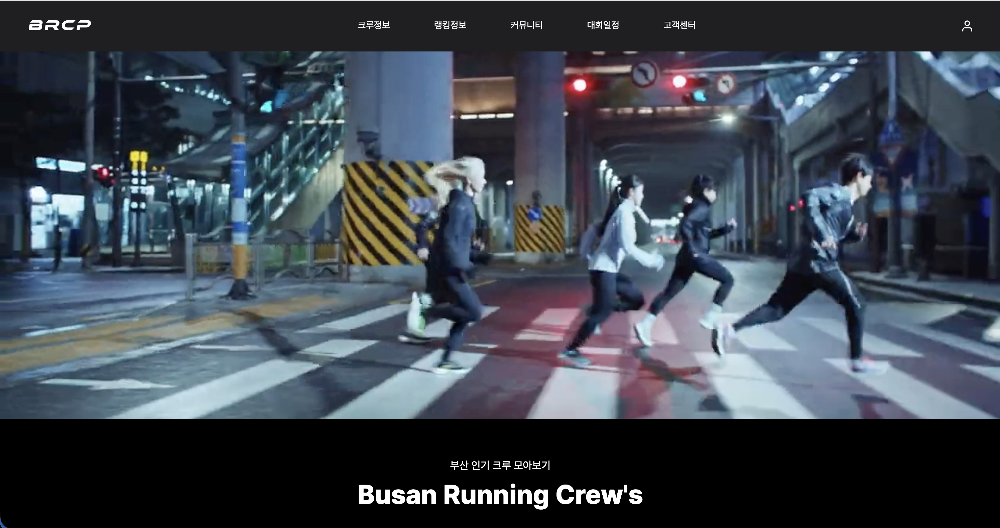
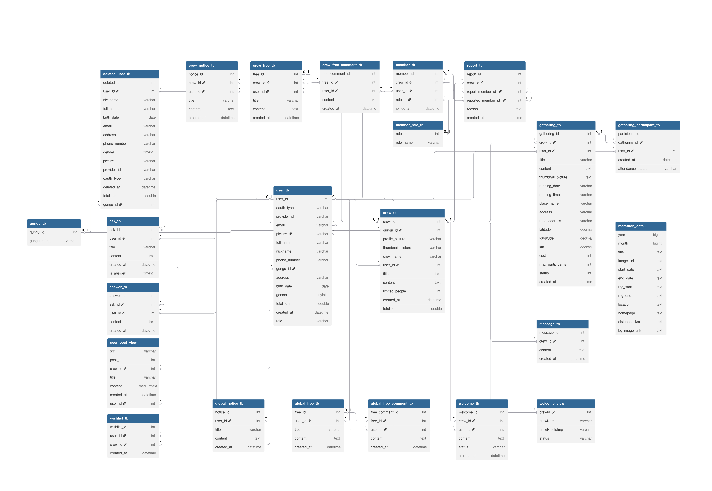
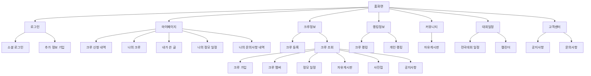
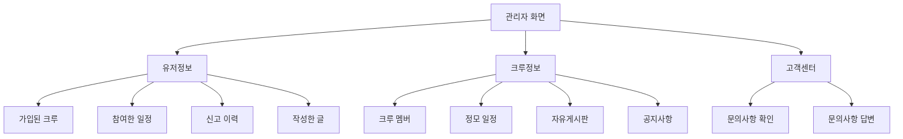
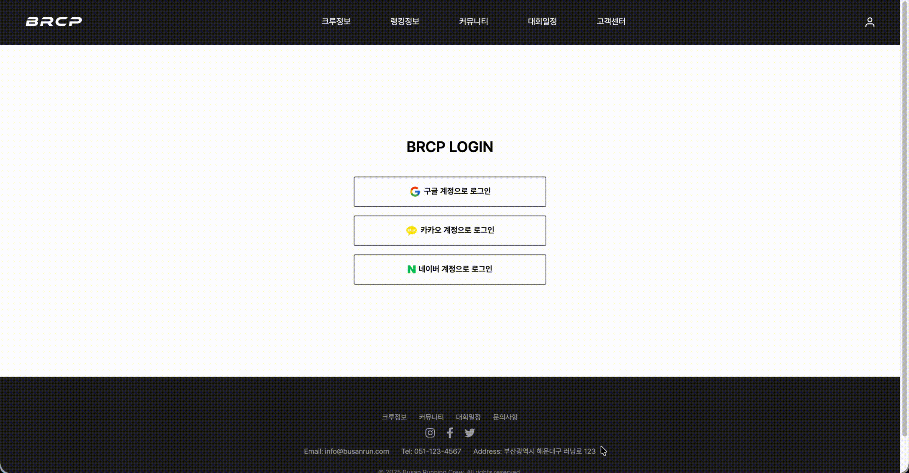
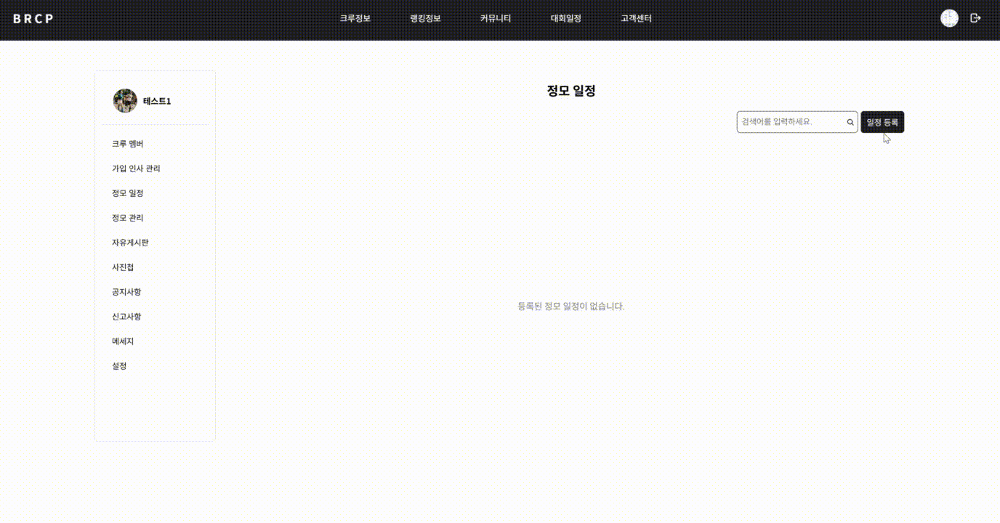
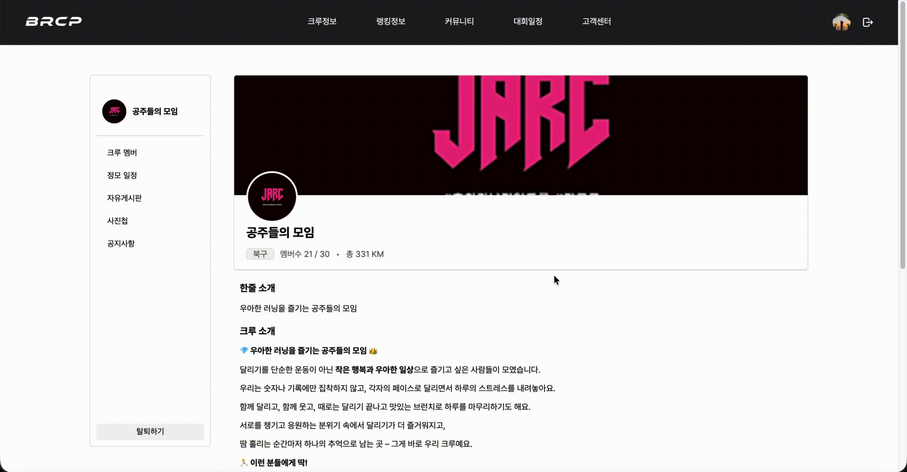

# 🔖 목차

> ## [✨ 프로젝트 소개](#프로젝트-소개)
> ## [👥 팀원 소개](#팀원-소개)
> ## [💼 역할 분담](#역할-분담)
> ## [🤝 협업 방식](#협업-방식)
> ## [📚 프로젝트 진행 상황 관리](#프로젝트-진행-상황-관리)
> ## [🔍 브랜치 전략](#브랜치-전략)
> ## [🛠 개발 도구](#개발-도구)
> ## [📆 프로젝트 일정](#프로젝트-일정)
> ## [📄 API 명세서 & ERD 설계도](#api-명세서--erd-설계도)
> ## [📋 메뉴 구조도](#메뉴-구조도)
> ## [🖥 화면 구현](#화면-구현)
> ## [💡 느낀점](#느낀점)

---

## ✨ 프로젝트 소개

**🏷 제목**  
- 🏃🏻 BRCP (Busan Running Crew Platform)
- 부산 지역 러너들을 위한 통합 플랫폼

**🚀 목적**  
- 부산 곳곳의 러닝 크루를 통합 관리하고,  
  크루 가입・정모・랭킹 시스템을 통해 러너들이 함께 뛰며 소통할 수 있도록 하는 플랫폼 구축.

**🤝 팀 프로젝트**  
총 3인

**📆 제작 기간**  
2025.08.01 ~ 2025.09.09

**🔎 주요 기능**
1. **사용자 로그인 및 크루 등록**
   - 회원가입 및 로그인 기능 제공  
   - 로그인 후 새로운 러닝 크루 생성 가능  
2. **러닝 크루 조회 및 가입**
   - 부산 지역의 다양한 러닝 크루 목록 확인  
   - 크루별 정보 및 활동 확인  
   - 관심 있는 크루에 가입 신청 가능  
3. **정모 일정 등록 및 관리**
   - 크루 내 정기 모임(정모) 등록 및 관리  
   - 정모 일정은 캘린더에서 확인 가능  
   - 개인 참여 일정 관리 가능
4. **랭킹 시스템**
   - 달린 거리(KM)를 기준으로 크루/개인 랭킹 제공  
   - 건강한 경쟁을 통한 동기 부여  
5. **자유게시판**
   - 크루 전용 게시판 및 전체 자유게시판 기능  
   - 공지사항, 문의사항 등 기능  
6. **전국 마라톤 대회 일정 제공**
   - 전국 주요 마라톤 대회 일정 확인  
   - 크루 단체 참여를 위한 일정 공유  

  <a href="#목차">🔝 TOP</a>

---

## 👥 팀원 소개

| 이름 | 배포 사이트 | GitHub |
|------|------|-------------|
| 염진우 | [s2runningcrew.store](https://s2runningcrew.store) | [@duawlsdn](https://github.com/duawlsdn) |
| 김선영 | [busanrun.store](https://busanrun.store) | [@chulog](https://github.com/kksun0202) |
| 제다정 | [s2runningcrew.site](https://s2runningcrew.site) | [@dajeong01](https://github.com/dajeong01) |

  <a href="#목차">🔝 TOP</a>

---

## 💼 역할 분담

### 🧑🏻‍💻 팀장: 염진우

- OAuth 2.0 기반 인증
- 크루 등록 및 관리 기능 구현
- 크루·개인 랭킹 기능 구현 (거리·참여 기준)
- 마이페이지 기능 구현
- 관리자 페이지 기능 구현

### 👩🏻‍💻 팀원: 김선영

- UI/UX 기획·화면 설계 및 디자인
- 추가 정보 입력 기능 구현
- 크루 정모 일정 등록 및 관리
- 참석자 출석 체크 & 러닝 거리 반영
- Kakao Map API를 활용한 위치 선택/표시 기능 제공

### 👩🏻‍💻 팀원: 제다정

- 크루 리스트 페이지 구현
- 크루 가입 및 멤버 관리 기능
- 자유게시판 등록 및 관리
- 신고 및 문의사항 처리 기능
- 대회 일정 수집 및 표시 (Python 크롤링)

  <a href="#목차">🔝 TOP</a>

---

## 🤝 협업 방식

1. **GitHub Issue**로 업무 단위 생성  
2. GitHub Actions 자동 브랜치 분기  
3. 각자 브랜치에서 기능 구현 후 `push`  
4. Pull Request → 팀장 코드 리뷰 → Merge  
5. Merge 시 자동으로 Issue `Done` 처리  

- 코드 리뷰는 팀장이 담당했지만,  
  모든 팀원이 코드 스타일과 로직을 공유하며 협업.

  <a href="#목차">🔝 TOP</a>

---

## 📚 프로젝트 진행 상황 관리

- **GitHub Issues**  
  이슈 템플릿을 만들어 담당자별 진행상황을 한눈에 확인할 수 있도록 구성  
- **GitHub Projects (Kanban)**  
  To Do → In Progress → Done 구조로 시각적 관리  
- **Notion**  
  일정표, API 문서, 피드백 기록 통합 관리  

  <a href="#목차">🔝 TOP</a>

---

## 🔍 브랜치 전략

💡 **GitHub Flow 전략 사용**  
- 기능 단위로 브랜치를 분리하여 작은 단위로 개발  
- main 브랜치에 지속적으로 병합  
- 충돌을 최소화하고 협업 효율을 높임  

> 작업 방식:  
> Issue 생성 → 기능 브랜치 생성 → 개발 완료 후 PR → 리뷰 후 Merge  

  <a href="#목차">🔝 TOP</a>

---

## 🛠 개발 도구

| 구분 | 사용 기술 |
|------|------------|
| **Front-End** | React.js, Emotion CSS, Zustand, Kakao Map API |
| **Back-End** | SSpring Boot, MyBatis |
| **Database** | MySQL 8.0 (AWS RDS) |
| **Authentication** | JWT, OAuth 2.0 |
| **Deployment / CI** | AWS, GitHub Actions, Docker |

  <a href="#목차">🔝 TOP</a>

---

## 📆 프로젝트 일정

| 기간 | 주요 진행 내용 |
|------|----------------|
| 8/01 ~ 8/07 | 기획 및 디자인 시안 완성 |
| 8/08 ~ 8/14 | 프론트엔드/백엔드 구조 설계 |
| 8/15 ~ 8/25 | 주요 기능 구현 |
| 8/26 ~ 9/03 | 테스트 및 오류 수정 |
| 9/04 ~ 9/09 | 배포 및 발표 준비 |

  <a href="#목차">🔝 TOP</a>

---

## 📄 API 명세서 & ERD 설계도

- 🛰 **API 명세서**
  프로젝트에서 사용된 API 관련 문서는 Notion에서 확인할 수 있습니다.  
  아래 버튼 또는 링크를 통해 바로 접근 가능합니다.

  [API 명세서 확인하기](https://www.notion.so/269909ed6ec38025b1f2c3fa799a87e4?v=269909ed6ec3810b89a1000cc3ff7d5d&source=copy_link)

   > 🔹 Notion 페이지에는 엔드포인트, 요청/응답 형식, 인증 방식 등이 자세히 정리되어 있습니다.

- 📐 **ERD 설계도**  
  

  <a href="#목차">🔝 TOP</a>

---

## 📋 메뉴 구조도

**🧑‍🤝‍🧑 사용자 메뉴 구조도**

---

**🧑‍💼 관리자 메뉴 구조도**

  <a href="#목차">🔝 TOP</a>

---

## 🖥 화면 구현

<table>
<tr>
  <th>사용자 로그인</th>
  <th>크루 등록</th>
</tr>
<tr>
  <td></td>
  <td></td>
</tr>

<tr>
  <th>크루 조회 및 가입</th>
  <th>정모 일정 등록</th>
</tr>
<tr>
  <td></td>
  <td></td>
</tr>

<tr>
  <th>자유게시판</th>
  <th>개인/크루 랭킹</th>
</tr>
<tr>
  <td></td>
  <td></td>
</tr>

<tr>
  <th>대회 일정</th>
  <th>관리자페이지</th>
</tr>
<tr>
  <td></td>
  <td></td>
</tr>
</table>

  <a href="#목차">🔝 TOP</a>

---

## 💡 느낀점

### 🧑🏻‍💻 염진우
프로젝트 전반의 인증 및 핵심 기능을 담당하면서, 서비스의 구조적 안정성이 얼마나 중요한지 깨달았습니다.  
OAuth 2.0 인증 로직을 구현하며 사용자 데이터 흐름을 깊이 이해할 수 있었고,  
여러 페이지 간 상태 관리와 API 연동 과정을 통해 실무에 가까운 협업 경험을 쌓을 수 있었습니다.  
팀 리더로서 일정 관리와 커뮤니케이션의 중요성도 함께 배웠습니다.

---

### 👩🏻‍💻 김선영
사용자 경험을 중심으로 UI/UX를 설계하며, **“직관적인 인터페이스가 곧 서비스의 완성도”** 라는 점을 느꼈습니다.  
Kakao Map API를 활용한 위치 표시 기능과 정모 관리 기능을 개발하면서,  
디자인과 기능이 자연스럽게 연결되는 구조를 고민할 수 있었습니다.  
기획부터 구현까지 직접 참여하며 팀원들과의 피드백 과정이 큰 도움이 되었습니다.

---

### 👩🏻‍💻 제다정
여러 기능을 동시에 구현하면서 **데이터 흐름을 명확히 설계하는 것의 중요성**을 깨달았습니다.  
크루 리스트, 게시판, 대회 일정 등 다양한 페이지를 담당하며 백엔드와의 연동 과정을 반복적으로 경험했고,  
Python 크롤링을 활용해 실제 데이터를 다루는 재미를 느꼈습니다.  
협업 과정에서 코드 스타일 통일과 커뮤니케이션의 필요성도 실감할 수 있었습니다.

[🔝 TOP](#목차)

---
